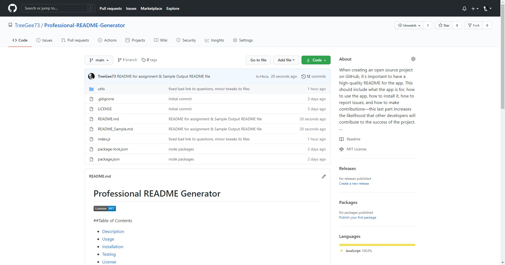

# Professional README Generator


---

## 📚 Educational Project

This project was completed as part of University of Arizona Full-Stack Web Development Bootcamp to demonstrate understanding of: **Node.js fundamentals, npm package management, Inquirer.js for CLI prompts, file system operations (fs module), template literals for dynamic content generation, and command-line application development**.

**Status:** Archived - No longer under active development  
**Purpose:** Portfolio demonstration of Node.js CLI application development and automated file generation  
**Completed:** December 2020

---

## Table of Contents
  * [Description](#description)
  * [Usage](#usage)
  * [Technology](#technology)
  * [Installation](#installation)
  * [Testing](#testing)
  * [Demo Video](#demo-video)
  * [License](#license)
  * [Contributing to This Repo](#contributing-to-this-repo)
  * [Questions / Contact Details](#questions--contact-details)

---

## Description

Create a professional README.md file for a project based on the answers to templated questions. This command-line application accepts user input and generates a high-quality, standardized README file with proper formatting, table of contents, license badges, and contact information.

---

## Usage

### Project Criteria

GIVEN a command-line application that accepts user input:

WHEN I am prompted for information about my application repository  
- [x] THEN a high-quality, professional README.md is generated with the title of my project and sections entitled Description, Table of Contents, Installation, Usage, License, Contributing, Tests, and Questions

WHEN I enter my project title  
- [x] THEN this is displayed as the title of the README

WHEN I enter a description, installation instructions, usage information, contribution guidelines, and test instructions  
- [x] THEN this information is added to the sections of the README entitled Description, Installation, Usage, Contributing, and Tests

WHEN I choose a license for my application from a list of options  
- [x] THEN a badge for that license is added near the top of the README and a notice is added to the section of the README entitled License that explains which license the application is covered under

WHEN I enter my GitHub username  
- [x] THEN this is added to the section of the README entitled Questions, with a link to my GitHub profile

WHEN I enter my email address  
- [x] THEN this is added to the section of the README entitled Questions, with instructions on how to reach me with additional questions

WHEN I click on the links in the Table of Contents  
- [x] THEN I am taken to the corresponding section of the README

---

## Technology

* **JavaScript** (100%) - Node.js application logic
* **Node.js** - Runtime environment
* **Inquirer.js** - Command-line interface prompts
* **File System (fs) module** - File creation and manipulation

---

## Installation
```bash
npm i
```

---

## Testing
```bash
npm test
```

---

## Demo Video

A video demonstration of this application can be found [here](https://youtu.be/ySOsC02z56A).

Click the image to launch the video:

[](https://www.youtube.com/watch?v=ySOsC02z56A "Demo Video")

---

## License

The application is covered under a MIT license.

---

## Contributing to This Repo

This project is archived and no longer accepting contributions. It serves as a portfolio demonstration of Node.js CLI development skills.

---

## Questions / Contact Details

If you have any questions about this project, please visit my GitHub profile at [TreeGee73](https://github.com/TreeGee73).
